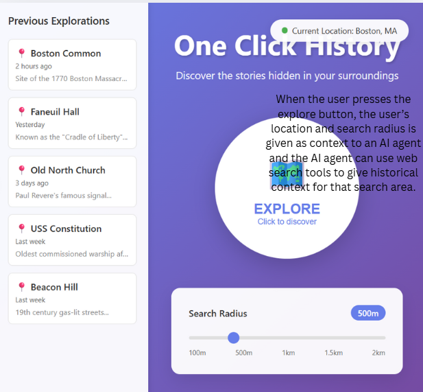

# Original concept: Concept HistoricalContextAgent

**Purpose:** generate location-aware historical narratives

**Principle:** given a location and radius, synthesize relevant historical information into engaging context; answer follow-up questions grounded in that context

## State:
A set of ActiveContexts with:
- A sessionId String
- A baseContext String (the generated historical narrative)
- A location Coordinates
- A radius Number

## Actions:

### generateContext(location: Coordinates, radius: Number): (context: String, mainLocation: String, sessionId: String)
- **Requires:** valid coordinates and positive radius
- **Effects:** Queries historical sources for location within radius, generates narrative context, identifies most significant location as mainLocation, creates ActiveContext with new sessionId
- **Returns:** context narrative, main location name, session id

### answerQuestion(sessionId: String, question: String): (answer: String)
- **Requires:** ActiveContext exists with sessionId
- **Effects:** Generates answer based on baseContext and question
- **Returns:** answer grounded in historical context

### clearSession(sessionId: String)
- **Requires:** ActiveContext exists with sessionId
- **Effects:** Removes ActiveContext from set

## AI Augmented
I've chosen to augment the context generation. Instead of using an integration with google maps to find nearby locations and some kind of popularity measure to find historical landmarks, we can simply hand the coordinates and radius to the AI and have it return the context. Without the automation to generate the context, there would be way too much friction, making the application obsolete versus simply using google.

# Concept AIHistoricalContextAgent

**Purpose:** generate location-aware historical narratives

**Principle:** given a location and radius, synthesize relevant historical information into engaging context; answer follow-up questions grounded in that context

## State:
A set of ActiveContexts with:
- A sessionId String
- A baseContext String (the generated historical narrative)
- A location Coordinates
- A radius Number

## Actions:

### generateContext(location: Coordinates, radius: Number): (context: String, mainLocation: String, sessionId: String)
- **Requires:** valid coordinates and positive radius
- **Effects:** AI generates narrative context, identifies most significant location as mainLocation, creates ActiveContext with new sessionId
- **Returns:** context narrative, main location name, session id

### answerQuestion(sessionId: String, question: String): (answer: String)
- **Requires:** ActiveContext exists with sessionId
- **Effects:** AI Generates answer based on baseContext and question, adds question/answer pair to base context
- **Returns:** answer grounded in historical context

### clearSession(sessionId: String)
- **Requires:** ActiveContext exists with sessionId
- **Effects:** Removes ActiveContext from set

## UI Sketch:

## Test Case 1: Boston Historical Context with Follow-up Questions
The first test case validates the core functionality using Boston coordinates. The system generates historical context for the area, then answers two follow-up questions: one about top schools (which must mention Harvard) and one about the body of water (which must mention Atlantic). This test ensures the agent can both generate rich historical narratives and answer contextual questions by drawing on both the generated context and broader geographic knowledge of the area.

## Test Case 2: Multi-Scale Context with Radius-Based Main Location
The second test demonstrates how the main location should scale appropriately with the radius. Using the same Boston coordinates, we test three radii: a small radius (500m) should return a specific landmark like "Old State House" rather than just "Boston"; a medium radius (10km) should return the city name "Boston"; and a large radius (500km) should return a regional name like "New England" rather than a city. The prompts explicitly guide the LLM to match the geographic scale to the radius, ensuring users get appropriately scoped historical context.

## Test Case 3: Desolate Location with No Historical Context
The third test uses Point Nemo coordinates in the middle of the Pacific Ocean to verify the system can recognize when there is genuinely no historical context. For truly desolate locations with small radii, the system should return "No significant historical location" rather than fabricating content. This test demonstrates the system's ability to appropriately decline providing context when none exists, catching cases where the LLM might hallucinate land-based locations in oceanic coordinates.

## Validators: Retry Loop with Secondary Agent Review
I implemented a retry loop (up to 3 attempts) with two-stage validation. First, we validate that the JSON output is correctly formatted. Second, a secondary agent reviews the response for hallucinations, checking geographic accuracy (especially hemisphere mismatches), verifying the claimed location exists at the given coordinates, and ensuring desolate locations aren't assigned fabricated historical content. When validation fails, the error reason is added to the next prompt, allowing the LLM to learn from its mistakes and self-correct rather than repeatedly making the same error.